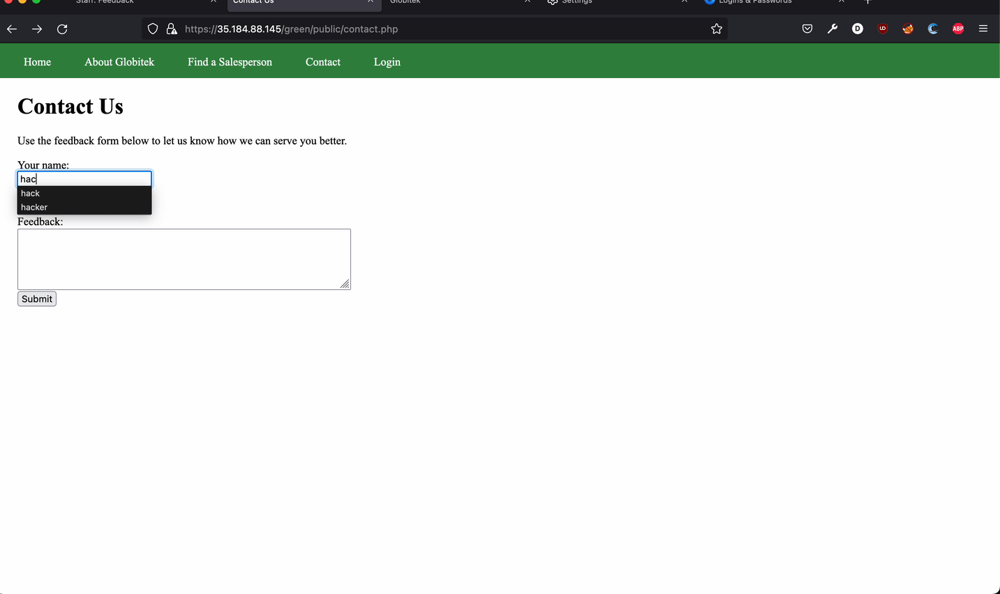
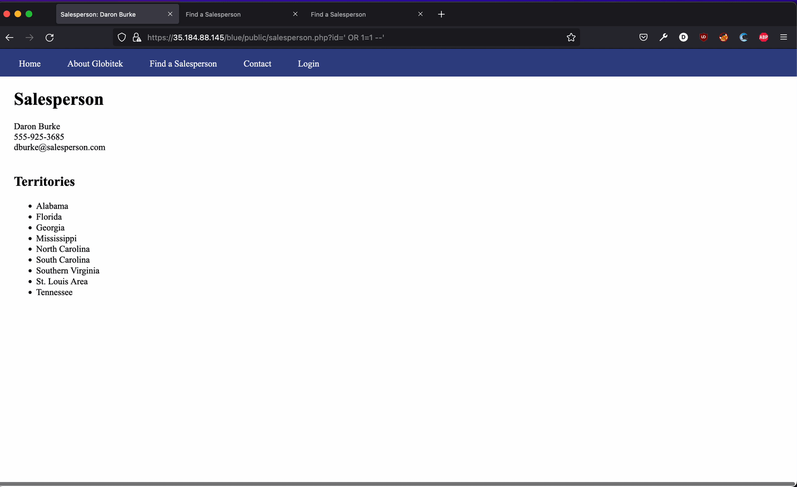
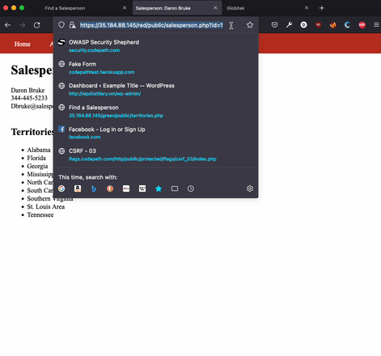

# Project 8 - Pentesting Live Targets

Time spent: **X** hours spent in total

> Objective: Identify vulnerabilities in three different versions of the Globitek website: blue, green, and red.

The six possible exploits are:

* Username Enumeration
* Insecure Direct Object Reference (IDOR)
* SQL Injection (SQLi)
* Cross-Site Scripting (XSS)
* Cross-Site Request Forgery (CSRF)
* Session Hijacking/Fixation

Each color is vulnerable to only 2 of the 6 possible exploits. First discover which color has the specific vulnerability, then write a short description of how to exploit it, and finally demonstrate it using screenshots compiled into a GIF.

Vulnerability #1: XSS

Description:
XSS in the contact page. Go to admin and have the script deployed.

Vulnerability #2: SQLi proof of concept

Description:
On one of the versions of the site you're allowed to inject SQL into the id parameter fo salespeople.

Vulnerability #3: IDOR

Description:
You are able to change the id paramter and access salespeople that shouldn't be avaiable.

