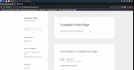
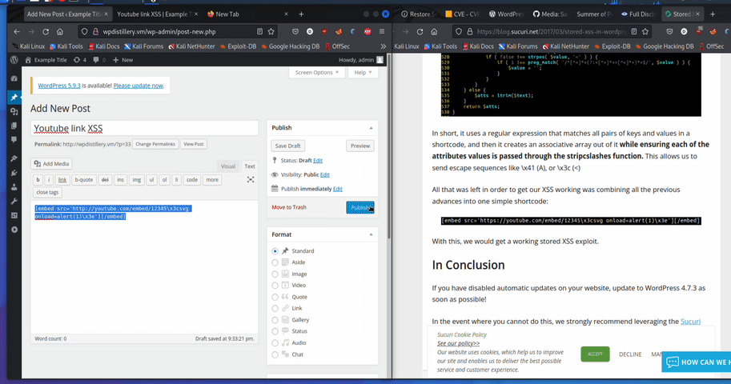

# Project 7 - WordPress Pentesting

Time spent: **5** hours spent in total

> Objective: Find, analyze, recreate, and document **five vulnerabilities** affecting an old version of WordPress

## Pentesting Report

### 1. Unauthenticated Stored Cross-Site Scripting 
  - [x] Summary: 
    - Vulnerability types: XSS
    - Tested in version: 4.2
    - Fixed in version:  4.2.1
  - [x] GIF Walkthrough: 
  
  - [x] Steps to recreate: 
        Place the following HTML element in a comment box.
        "" where there are 64 kb of content in order for the backend to truncate the comment and store the XSS. If the commenter is already approved, the commenter will be able to make the comment. Then the administrator, when they look at the comments again, will be vulnerable to the stored XSS.

### 2. Authenticated Stored Cross-Site Scripting 
  - [x] Summary: 
    - Vulnerability types: XSS
    - Tested in version: 4.2
    - Fixed in version: 4.2.2
  - [x] GIF Walkthrough: 
  
  - [x] Steps to recreate: 
  Place the following anchor tag in the WordPress HTML editor as a user 
  who can write posts: 
  \<a href="</a><a title=' onmouseover=alert("test")  '>link</a>
  Mouseover the link and the javascript is run on the post.

### 3. XXS in Youtube Url using short codes
  - [x] Summary: 
    - Vulnerability types: XSS
    - Tested in version: 4.2
    - Fixed in version: 4.7.3
  - [x] GIF Walkthrough: 
  
  - [x] Steps to recreate: 
  Type the following in an HTML input in WordPress:
[embed src='http://youtube.com/embed/12345\x3csvg onload=alert(1)\x3e'][/embed]

## Resources

- [WordPress Source Browser](https://core.trac.wordpress.org/browser/)
- [WordPress Developer Reference](https://developer.wordpress.org/reference/)

GIFs created with [LiceCap](http://www.cockos.com/licecap/).

## Notes

Describe any challenges encountered while doing the work
I had a hard time reading some of the workups of other people but that got easier.

## License

    Copyright [yyyy] [name of copyright owner]

    Licensed under the Apache License, Version 2.0 (the "License");
    you may not use this file except in compliance with the License.
    You may obtain a copy of the License at

        http://www.apache.org/licenses/LICENSE-2.0

    Unless required by applicable law or agreed to in writing, software
    distributed under the License is distributed on an "AS IS" BASIS,
    WITHOUT WARRANTIES OR CONDITIONS OF ANY KIND, either express or implied.
    See the License for the specific language governing permissions and
    limitations under the License.
 
